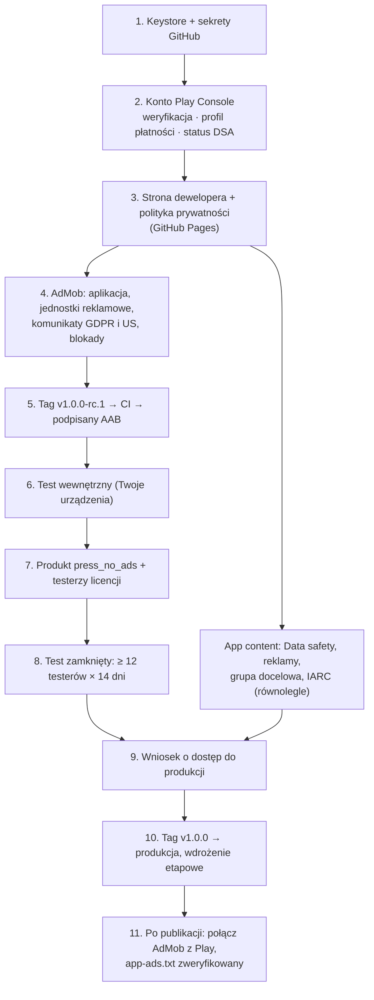

# PRESS — wydanie w Google Play (RELEASE)

> Praktyczny przewodnik dla jednoosobowego wydawcy. Pakiet: `pl.zeprzalka.press` · wersja startowa **1.0.0** · stan na **2026-10-07**.
> `[NAWIASY KWADRATOWE]` = miejsca do uzupełnienia (pełna lista: [§12](#12-checklista-przed-publikacją)).
> Konsole Google (Play, AdMob) często zmieniają nazwy menu. Jeśli coś wygląda inaczej niż tutaj, kieruj się sensem kroku i popraw ten plik.

## Spis treści

0. [Przegląd ścieżki wydania](#0-przegląd-ścieżki-wydania)
1. [Klucz podpisu (keystore) i Play App Signing](#1-klucz-podpisu-keystore-i-play-app-signing)
2. [Sekrety GitHub i CI](#2-sekrety-github-i-ci)
3. [Konto Play Console](#3-konto-play-console)
4. [Test zamknięty](#4-test-zamknięty)
5. [Produkt „Bez reklam”](#5-produkt-bez-reklam)
6. [AdMob](#6-admob)
7. [Polityka prywatności](#7-polityka-prywatności)
8. [Strona w sklepie (store listing)](#8-strona-w-sklepie-store-listing)
9. [Formularz bezpieczeństwa danych (Data safety)](#9-formularz-bezpieczeństwa-danych-data-safety)
10. [Pozostałe deklaracje](#10-pozostałe-deklaracje)
11. [Wymagania techniczne](#11-wymagania-techniczne)
12. [Checklista przed publikacją](#12-checklista-przed-publikacją)
13. [Rekomendacje po premierze](#13-rekomendacje-po-premierze)

---

## 0. Przegląd ścieżki wydania



| Kiedy | Co | Ile trwa |
|---|---|---|
| Dzień 0 | Załóż konto Play Console (weryfikacja tożsamości startuje od razu) | 1–7 dni; organizacja z D-U-N-S nawet kilka tygodni |
| Dzień 0–2 | Keystore, sekrety, GitHub Pages, konto i aplikacja AdMob | ~1 dzień pracy |
| Dzień 2–3 | Pierwszy AAB, test wewnętrzny, produkt IAP, testerzy licencji | 1–2 dni |
| Dzień 3–20 | Test zamknięty (pierwsza recenzja ścieżki: do kilku dni) + 14 dni ciągłego testu | ~17 dni |
| Dzień 20–27 | Wniosek o produkcję i jego recenzja | zwykle do 7 dni |
| Dzień ~27 | Premiera, wdrożenie etapowe 20% → 50% → 100% | 3–7 dni |

---

## 1. Klucz podpisu (keystore) i Play App Signing

### 1.1 Wygeneruj klucz przesyłania (upload key)

Poza repozytorium (np. w `~/keys/`; `.gitignore` i tak blokuje `*.jks`):

```bash
mkdir -p ~/keys && cd ~/keys
keytool -genkeypair -v \
  -keystore press-upload.jks \
  -storetype PKCS12 \
  -alias press \
  -keyalg RSA -keysize 4096 \
  -validity 10000 \
  -dname "CN=[FULL NAME / COMPANY], L=[CITY], C=PL"
```

- `keytool` zapyta o hasło magazynu. Wygeneruj je menedżerem haseł (≥ 20 znaków, bez spacji i znaków `$`, `"`, `'`, które psują się w powłoce i YAML).
- Format **PKCS12 ma jedno hasło** do magazynu i klucza (`keytool` ignoruje osobne `-keypass`). Dlatego sekrety `ANDROID_KEYSTORE_PASSWORD` i `ANDROID_KEY_PASSWORD` mają **tę samą wartość**.
- 10000 dni ≈ 27 lat. Google wymaga ważności co najmniej do 2033 r., więc to z zapasem.

### 1.2 Sprawdź odcisk i wyeksportuj certyfikat

```bash
keytool -list -v -keystore press-upload.jks -alias press | grep -E "SHA1|SHA256|Valid"
keytool -export -rfc -keystore press-upload.jks -alias press -file press-upload-cert.pem
sha256sum press-upload.jks > press-upload.jks.sha256
```

`press-upload-cert.pem` (sam certyfikat publiczny, nie klucz) przyda się, gdy trzeba będzie prosić Google o reset klucza przesyłania.

### 1.3 Przechowywanie i kopie zapasowe (2 lokalizacje)

- **Hasło** trzymaj w menedżerze haseł (Bitwarden / 1Password / KeePassXC) jako wpis „PRESS upload key” z aliasem `press` i odciskiem SHA-256.
- **Plik `.jks` zaszyfruj** i zapisz w dwóch fizycznie różnych miejscach, np. (1) zaszyfrowany pendrive lub dysk w domu, (2) załącznik w menedżerze haseł albo zaszyfrowane archiwum w chmurze:
  ```bash
  gpg --symmetric --cipher-algo AES256 -o press-upload.jks.gpg press-upload.jks
  # odtworzenie: gpg -d -o press-upload.jks press-upload.jks.gpg
  ```
- Hasło do `.gpg` nie może leżeć obok pliku.
- Raz w roku sprawdź, czy kopię da się odszyfrować, a `sha256sum -c press-upload.jks.sha256` zgadza się z oryginałem.
- Nigdy nie commituj keystore'a ani pliku base64 i nie wysyłaj ich mailem ani komunikatorem.

### 1.4 Play App Signing: klucz przesyłania a klucz podpisywania aplikacji

| | Klucz przesyłania (upload key) | Klucz podpisywania aplikacji (app signing key) |
|---|---|---|
| Kto ma | Ty (`press-upload.jks`) i CI | Google (w Play App Signing) |
| Do czego | Podpisuje AAB wysyłany do Play | Podpisuje APK instalowane u graczy |
| Utrata | Do odzyskania: reset w Play Console | Nie dotyczy, bo trzyma go Google |

**Zdecydowanie zalecane (a dla nowych aplikacji w formacie AAB w praktyce obowiązkowe): zapisz się do Play App Signing.** Przy pierwszym wydaniu (test wewnętrzny) Play Console zapyta o klucz podpisywania. Wybierz **„Use Google-generated key / Użyj klucza wygenerowanego przez Google”**. Nie wgrywaj własnego klucza aplikacji bez konkretnego powodu.

- Po zgubieniu klucza przesyłania: **Play Console → Test and release → App integrity → App signing → Request upload key reset**. Załączasz nowy certyfikat `.pem`, a reset trwa kilka dni.
- Odciski klucza aplikacji (np. do przyszłego Firebase) znajdziesz w tym samym miejscu: **App integrity → App signing**.

---

## 2. Sekrety GitHub i CI

### 2.1 Lista sekretów

| Sekret | Wartość | Kto czyta |
|---|---|---|
| `ANDROID_KEYSTORE_BASE64` | `base64 -w0 press-upload.jks` | CI dekoduje do pliku i ustawia `ANDROID_KEYSTORE_PATH` (czyta go `android/app/build.gradle`) |
| `ANDROID_KEYSTORE_PASSWORD` | hasło magazynu | `build.gradle` → `signingConfigs.release.storePassword` |
| `ANDROID_KEY_ALIAS` | `press` | `build.gradle` → `keyAlias` |
| `ANDROID_KEY_PASSWORD` | to samo hasło co wyżej (PKCS12) | `build.gradle` → `keyPassword` |
| `ADMOB_APP_ID` | `ca-app-pub-XXXXXXXXXXXXXXXX~YYYYYYYYYY` (**tylda**) | `build.gradle` → `manifestPlaceholders.admobAppId` → `AndroidManifest.xml` |
| `VITE_ADMOB_REWARDED_ID` | `ca-app-pub-XXXXXXXXXXXXXXXX/NNNNNNNNNN` (**ukośnik**) | `src/config.ts` → `ADS.rewarded` (wkompilowane przez Vite) |
| `VITE_ADMOB_INTERSTITIAL_ID` | `ca-app-pub-XXXXXXXXXXXXXXXX/MMMMMMMMMM` | `src/config.ts` → `ADS.interstitial` |
| `VITE_ADMOB_TEST_DEVICES` *(opcjonalny)* | `HASH1,HASH2` (zob. [§6.8](#68-urządzenia-testowe)) | `src/config.ts` → `ADS.testDevices`: te urządzenia dostają reklamy testowe mimo produkcyjnych ID |

Opcjonalnie dodaj **zmienną repozytorium** (nie sekret) `VITE_PRIVACY_URL`, jeśli polityka ma być pod innym adresem niż GitHub Pages ([§7](#7-polityka-prywatności)).

### 2.2 Ustawienie sekretów (GitHub CLI)

```bash
cd ~/keys
base64 -w0 press-upload.jks > press-upload.jks.b64        # macOS: base64 -i press-upload.jks | tr -d '\n' > press-upload.jks.b64
gh secret set ANDROID_KEYSTORE_BASE64 -R m-zeprzalka/press < press-upload.jks.b64
shred -u press-upload.jks.b64                              # macOS: rm -P press-upload.jks.b64

gh secret set ANDROID_KEYSTORE_PASSWORD -R m-zeprzalka/press   # wpisz hasło interaktywnie (nie trafi do historii powłoki)
gh secret set ANDROID_KEY_PASSWORD      -R m-zeprzalka/press   # to samo hasło
gh secret set ANDROID_KEY_ALIAS         -R m-zeprzalka/press --body press

# Po utworzeniu aplikacji i jednostek w AdMob (§6):
gh secret set ADMOB_APP_ID               -R m-zeprzalka/press --body 'ca-app-pub-XXXXXXXXXXXXXXXX~YYYYYYYYYY'
gh secret set VITE_ADMOB_REWARDED_ID     -R m-zeprzalka/press --body 'ca-app-pub-XXXXXXXXXXXXXXXX/NNNNNNNNNN'
gh secret set VITE_ADMOB_INTERSTITIAL_ID -R m-zeprzalka/press --body 'ca-app-pub-XXXXXXXXXXXXXXXX/MMMMMMMMMM'
gh secret set VITE_ADMOB_TEST_DEVICES    -R m-zeprzalka/press --body 'HASH1,HASH2'   # opcjonalnie

gh secret list -R m-zeprzalka/press
```

W przeglądarce: **repo → Settings → Secrets and variables → Actions → New repository secret**.

### 2.3 Co robi `.github/workflows/android.yml`

| Zdarzenie | Wynik | Reklamy |
|---|---|---|
| **Każdy push** | Artefakt **debug APK** | Testowe ID Google (`VITE_ADS_MODE` nieustawione) i debugowa geografia EEA dla UMP |
| **Tag `v*`** (np. `v1.0.0`) | Artefakt **podpisany release AAB** | `VITE_ADS_MODE=production` i ID z sekretów |

Build z tagu działa tak:

1. Dekoduje `ANDROID_KEYSTORE_BASE64` do pliku tymczasowego i ustawia `ANDROID_KEYSTORE_PATH` oraz pozostałe zmienne podpisu (bez nich `build.gradle` nie podpisze release'u).
2. Buduje web (`npm run build`) z `VITE_ADS_MODE=production`, `VITE_ADMOB_REWARDED_ID`, `VITE_ADMOB_INTERSTITIAL_ID` (i opcjonalnie `VITE_ADMOB_TEST_DEVICES`). Vite **wkompilowuje** te wartości w JS w chwili builda.
3. `npx cap sync android`, potem `./gradlew bundleRelease -PversionCode=<numer uruchomienia> -PversionName=<tag bez „v”>` z `ADMOB_APP_ID` w środowisku.
   - `versionCode` = `github.run_number`: rośnie z każdym uruchomieniem workflow, więc jest zawsze większy od poprzedniego.
   - `versionName` z tagu: `v1.0.0` → `1.0.0`, `v1.0.0-rc.2` → `1.0.0-rc.2`.
4. **Strażnik:** rozpakowuje AAB i przerywa build, jeśli znajdzie testowy identyfikator wydawcy Google `ca-app-pub-3940256099942544`, czyli gdy do release'u trafiły testowe reklamy (np. brak sekretu).
5. Publikuje AAB jako artefakt.

### 2.4 Wydanie wersji

```bash
git switch main && git pull
npm ci && npm test && npm run lint && npm run build     # lokalnie zielono, zanim otagujesz
npm version 1.0.0 --no-git-tag-version                   # tylko gdy zmieniasz numer (package.json); commit + push
git tag v1.0.0 && git push origin v1.0.0
gh run list --workflow android.yml --limit 3
gh run watch                                             # wybierz uruchomienie z tagu
gh run download <RUN_ID> --dir ~/press-release/v1.0.0   # pobiera artefakty (AAB)
```

- Podczas testów używaj tagów `v1.0.0-rc.1`, `v1.0.0-rc.2`, … Ostateczny `v1.0.0` możesz przetestować na ścieżce zamkniętej i **awansować** (Promote release) do produkcji bez ponownego budowania.
- **Do Play wysyłaj wyłącznie AAB z CI.** Lokalny build z większym `versionCode` zablokuje kolejne buildy z CI, bo Play odrzuca kody, które już były użyte.
- Debug APK z pusha zainstalujesz tak: `gh run download <RUN_ID> --dir /tmp/press-debug && adb install -r /tmp/press-debug/*/*.apk`.

### 2.5 Build release lokalnie (awaryjnie, np. do sprawdzenia)

```bash
export ANDROID_KEYSTORE_PATH=~/keys/press-upload.jks
export ANDROID_KEYSTORE_PASSWORD='…' ANDROID_KEY_PASSWORD='…' ANDROID_KEY_ALIAS=press
export ADMOB_APP_ID='ca-app-pub-XXXXXXXXXXXXXXXX~YYYYYYYYYY'
export VITE_ADS_MODE=production VITE_ADMOB_REWARDED_ID='ca-app-pub-…/…' VITE_ADMOB_INTERSTITIAL_ID='ca-app-pub-…/…'
npm run cap:sync && (cd android && ./gradlew bundleRelease -PversionCode=1 -PversionName=1.0.0)
ls -la android/app/build/outputs/bundle/release/
```

### 2.6 Gdy strażnik zgłasza testowe ID

```bash
AAB=$(ls ~/press-release/v1.0.0/*/*.aab | head -1)
rm -rf /tmp/aab && mkdir /tmp/aab && unzip -q "$AAB" -d /tmp/aab
grep -raoE "ca-app-pub-[0-9]{16}[~/][0-9]{10}" /tmp/aab | sort -u
```

- Brak Twojego `pub-…` → sprawdź `gh secret list` (literówka w nazwie, pusty sekret, tylda zamieniona z ukośnikiem).
- Testowe ID tylko w plikach JS → build nie dostał `VITE_ADS_MODE=production`. `src/config.ts` wybiera ID przez **bezpośrednie** porównanie `import.meta.env.VITE_ADS_MODE`, więc Vite usuwa gałąź testową z bundla produkcyjnego; nie zamieniaj tego na odczyt przez alias (np. `const env = import.meta.env`), bo wtedy literały testowe zostaną w JS.
- Testowe ID w `base/manifest` → brak `ADMOB_APP_ID` w środowisku Gradle.

---

## 3. Konto Play Console

Rejestracja: <https://play.google.com/console/signup> (jednorazowa opłata 25 USD).

### 3.1 Konto osobiste czy organizacji?

| | Osobiste | Organizacji |
|---|---|---|
| Weryfikacja | Dokument tożsamości, zweryfikowany e-mail i telefon; konsola może poprosić o potwierdzenie dostępu do fizycznego urządzenia z Androidem (aplikacja Play Console) | **Numer D-U-N-S** (bezpłatny, wydaje Dun & Bradstreet; czeka się nawet kilka tygodni). Nazwa i adres firmy muszą być identyczne z danymi w D-U-N-S |
| Test zamknięty przed produkcją | **Wymagany** (12 testerów × 14 dni, [§4](#4-test-zamknięty)), jeśli konto założono po 13.11.2023 | Nie jest wymagany |
| Publiczne dane | Imię i nazwisko (i dane DSA, jeśli jesteś przedsiębiorcą) | Nazwa firmy |

- Jednoosobowa działalność zwykle też może dostać D-U-N-S i założyć konto organizacji. Oszczędza to test 12 × 14, ale wydłuża start.
- Konto osobiste jest szybsze. Jeśli je wybierasz, zaplanuj test zamknięty.

### 3.2 Profil płatności i konto sprzedawcy

**Wymagane przed utworzeniem produktu `press_no_ads`.**

1. **Play Console → Setup → Payments profile** (Ustawienia → Profil płatności): utwórz lub połącz profil płatności Google (indywidualny albo firmowy).
2. Dodaj konto bankowe do wypłat (weryfikacja przelewem testowym).
3. Uzupełnij informacje podatkowe. Dla USA: formularz W-8BEN (osoba fizyczna) lub W-8BEN-E (firma) z rezydencją podatkową w Polsce.
4. Rozliczenie VAT i PIT/CIT od przychodów z Google skonsultuj z księgową.

### 3.3 Status przedsiębiorcy (EU Digital Services Act)

**Play Console → Setup → Developer account → About you / Trader status.**

- Gra zarabia (reklamy i IAP), więc **zadeklaruj status przedsiębiorcy (trader)**.
- Google pokaże wtedy publicznie na stronie aplikacji w UE: nazwę, **adres, telefon i e-mail**. Bez deklaracji Google może wycofać aplikację z krajów UE.
- Zamiast adresu domowego użyj adresu firmy lub **wirtualnego biura**.
- Załóż **osobny e-mail wsparcia** (np. `[CONTACT EMAIL]`) i, jeśli to możliwe, osobny numer telefonu (druga karta SIM / VoIP), bo te dane będą publiczne.

### 3.4 Strona dewelopera

Potrzebna do **app-ads.txt** ([§6.6](#66-app-adstxt)) i jako „Website” w danych kontaktowych sklepu:

- najprościej `https://m-zeprzalka.github.io/` (repo `m-zeprzalka.github.io`);
- docelowo własna domena `[DEVELOPER WEBSITE]`.

### 3.5 Utworzenie aplikacji

**Play Console → Create app:**

- App name `PRESS`, default language **English (United States) – en-US**.
- **Game**, **Free**. Aplikacji darmowej nie zmienisz później na płatną; IAP jest dozwolone.
- Zaakceptuj deklaracje.

Nazwa pakietu `pl.zeprzalka.press` ustali się przy pierwszym przesłanym AAB i **jest nieodwracalna**.

---

## 4. Test zamknięty

Konto osobiste założone po 13 listopada 2023 r. musi przed dostępem do produkcji przeprowadzić test zamknięty: **co najmniej 12 testerów zapisanych (opted-in) nieprzerwanie przez 14 dni**. Licznik w Dashboardzie pokazuje postęp. Zrekrutuj **15–20 osób**, bo ktoś zawsze się wypisze lub zmieni telefon i ciągłość się urywa.

### 4.1 Najpierw test wewnętrzny (Ty, bez recenzji)

1. **Test and release → Testing → Internal testing → Create new release.**
2. Prześlij AAB z tagu `v1.0.0-rc.1`. Przy tym przesłaniu Play Console zapisze aplikację do Play App Signing ([§1.4](#14-play-app-signing-klucz-przesyłania-a-klucz-podpisywania-aplikacji)).
3. Dodaj swoje konta Google na liście testerów i otwórz link opt-in.
4. Zainstaluj z Play: <https://play.google.com/store/apps/details?id=pl.zeprzalka.press>. Billing działa tylko w kopii zainstalowanej z Play.

### 4.2 Ścieżka zamknięta krok po kroku

1. **Test and release → Testing → Closed testing → Create track** (albo domyślny „Closed testing – Alpha”).
2. **Countries/regions:** Polska i kraje, w których mieszkają testerzy.
3. **Testers:**
   - najlepiej **Grupa Google** (np. `press-testers@googlegroups.com`, dołączanie: „każdy z linkiem” lub na zaproszenie), bo testerów dodajesz bez edycji ścieżki;
   - alternatywnie lista e-maili.
   - Podaj **feedback URL lub e-mail**: `[CONTACT EMAIL]`.
4. **Create release** → prześlij AAB (z CI) → nazwa wydania np. `1.0.0-rc.2 (42)` → informacje o wersji EN/PL → **Review release → Start rollout to Closed testing**.
5. Wyślij zmiany do recenzji (**Publishing overview → Send for review**). Pierwsza recenzja może potrwać kilka dni.
6. **Link opt-in** (zakładka Testers): `https://play.google.com/apps/testing/pl.zeprzalka.press`. Tester otwiera go na koncie Google z listy, klika „Become a tester”, potem instaluje z linku do sklepu.

**Wiadomość do testerów (do wklejenia):**

> PL: Cześć! Testuję PRESS, logiczną grę z klockami w klimacie drukarni. Potrzebuję Cię na 14 dni (wymóg Google): 1) dołącz do grupy [LINK DO GRUPY], 2) otwórz https://play.google.com/apps/testing/pl.zeprzalka.press i kliknij „Zostań testerem”, 3) zainstaluj grę z Google Play, 4) zagraj kilka razy w ciągu tych dwóch tygodni i **nie wypisuj się do końca testu**. Uwagi: [CONTACT EMAIL]. Prośba: nie klikaj w reklamy. Dzięki!
>
> EN: Hi! I'm testing PRESS, a print-shop block puzzle. I need you for 14 days (a Google requirement): 1) join [GROUP LINK], 2) open https://play.google.com/apps/testing/pl.zeprzalka.press and tap "Become a tester", 3) install the game from Google Play, 4) play a few times over the two weeks and **stay opted in until the test ends**. Feedback: [CONTACT EMAIL]. Please don't tap on ads. Thanks!

**Reklamy w teście zamkniętym.**

- Buildy z tagu mają produkcyjne ID. Swoje urządzenia i urządzenia bliskich testerów dopisz do `VITE_ADMOB_TEST_DEVICES` ([§6.8](#68-urządzenia-testowe)); pozostałych poproś, żeby nie klikali reklam.
- Dopóki aplikacja AdMob nie jest połączona ze sklepem, reklamy i tak są wyświetlane w ograniczonym zakresie.

### 4.3 QA w czasie testu

#### Płatności (Billing)

Dodaj testerów licencji:

- **Play Console → Setup → License testing**: dodaj konta Gmail (swoje i 1–2 zaufanych osób), License response: `RESPOND_NORMALLY`.
- Tester licencji musi mieć grę z Play (ścieżka testowa) i to samo konto jako główne w Sklepie Play.
- W oknie zakupu zobaczy testowe metody płatności.

| Scenariusz | Jak | Oczekiwany wynik |
|---|---|---|
| Zakup udany | „Test card, always approves” | Od razu „Dziękujemy! Reklamy wyłączone.”; interstitiale znikają, nagrody bez wideo |
| Odmowa | „Test card, always declines” | Komunikat błędu, nic nie przyznane |
| Płatność w toku | **„Slow test card, approves after a few minutes”** | „Płatność w toku — odblokujemy po potwierdzeniu.”; po kilku minutach i powrocie do aplikacji uprawnienie aktywne |
| Płatność w toku, odrzucona | „Slow test card, declines after a few minutes” | Brak uprawnienia, komunikat „w toku” znika |
| Anulowanie okna | Zamknij okno płatności | Cicho, bez komunikatu błędu |
| Potwierdzenie (acknowledge) | Po zakupie odczekaj ~10 min, sprawdź Order management | Zamówienie **nie** zostaje automatycznie zwrócone (zakupy testowe mają skrócone okno potwierdzenia) |
| Przywrócenie | Odinstaluj, zainstaluj ponownie albo „Przywróć zakup” | Uprawnienie wraca bez ponownej płatności |
| Zwrot | **Play Console → Order management** → zamówienie → **Refund** (zaznacz „Remove entitlement”) | Po zimnym starcie lub powrocie na pierwszy plan reklamy wracają |
| Offline | Tryb samolotowy po zakupie | Uprawnienie zostaje (bufor lokalny), nie jest cofane |

#### Zgoda UMP

Najpierw **debug APK** (testowe ID, debugowa geografia EEA):

1. Na fizycznym telefonie odczytaj hash urządzenia:
   ```bash
   adb logcat | grep -E "addTestDeviceHashedId|setTestDeviceIds"
   ```
   Zwykle UMP i reklamy podają ten sam hash. Emulator jest urządzeniem testowym automatycznie.
2. Zbuduj z hashem:
   ```bash
   VITE_ADMOB_TEST_DEVICES=TWÓJ_HASH npm run android:debug
   adb install -r android/app/build/outputs/apk/debug/app-debug.apk
   ```
3. Zresetuj stan:
   ```bash
   adb shell pm clear pl.zeprzalka.press    # UWAGA: kasuje też zapisy gry
   ```
4. Sesja 1: **brak** formularza i jakichkolwiek wywołań SDK reklam (`adb logcat | grep -iE "Ads|UserMessagingPlatform"` milczy).
5. Wymuś sesję 2:
   ```bash
   adb shell am force-stop pl.zeprzalka.press
   ```
   Uruchom ponownie: formularz pojawia się na ekranie tytułowym, **nigdy w trakcie gry**.
6. Sprawdź warianty: „Zgadzam się”, „Nie zgadzam się” / „Zarządzaj opcjami”. Po odmowie gra działa, przyciski reklamowe działają albo są ukryte, gdy `canRequestAds = false`.
7. **Ustawienia → Prywatność i zakupy → Ustawienia prywatności** jest widoczne w EEA i otwiera formularz; zmiana działa od następnej reklamy.

Potem **release z testu zamkniętego**: w Polsce (EEA) zobaczysz prawdziwy komunikat z AdMob, pod warunkiem że jest opublikowany ([§6.4](#64-prywatność-i-wiadomości-gdpr-i-stany-usa)). Sprawdź język PL/EN i link do polityki w formularzu.

#### Reklamy (GDD §11)

- **Pierwsza sesja:** zero reklam. Pierwszy możliwy interstitial: sesja ≥ 2 **i** ≥ 2 przegrane runy.
- **Interstitial tylko** po stuknięciu „Nowy run” / „Menu” na ekranie wyniku. Nigdy:
  - po „wstecz”, „Graj dalej (bez końca)”, porzuceniu z Pauzy;
  - przy zimnym starcie lub wznowieniu;
  - gdy ekran wyniku był widoczny < 2 s;
  - w runie z obejrzaną reklamą nagradzaną.
- **Odstęp:** ≥ 2 runy i ≥ 240 s od ostatniej reklamy pełnoekranowej.
- **Przeładowanie:**
  - najpierw darmowe;
  - potem reklama: ≤ 1 na ekran oferty, ≤ 3 na run;
  - w wyzwaniu dnia brak przeładowań za reklamę.
- **Dodruk:**
  - pierwszy w życiu darmowy, potem za reklamę;
  - po zacięciu zdejmuje 2 rzędy i 2 kolumny, po braku arkuszy daje +8 arkuszy.
- **Wyzwanie dnia:** 1 dodatkowe podejście za reklamę.
- **Nagroda tylko po obejrzeniu do końca.** Zamknięcie wcześniej = brak nagrody. Brak reklamy przez 6 s → „Reklama niedostępna — spróbuj ponownie”, a szansa nie przepada.
- **Zabicie aplikacji w trakcie reklamy nagradzanej** (`adb shell am kill pl.zeprzalka.press` po przejściu do tła): po starcie nagroda jest przyznana albo zaproponowana ponownie.
- Dźwięk gry milknie na czas reklamy i wraca po niej.

#### Przycisk wstecz i cykl życia

- Każdy wiersz tabeli GDD §12.3: przeciąganie, arkusz/dialog, gra → Pauza, oferta, tryb wymiany, Ostatnia szansa / Dodruk, Zwycięstwo, Wynik → Tytuł (bez interstitiala), Tytuł → minimalizacja.
- Gest „predictive back” na Androidzie 14+.
- **Wznowienie po zabiciu:**
  1. Włącz Opcje programisty → „Nie zachowuj działań” (Don't keep activities).
  2. W trakcie runu: przejdź do tła, potem `adb shell am kill pl.zeprzalka.press`.
  3. Uruchom ponownie. „Wznów run” odtwarza dokładnie ten sam stan: tacę, schowek, ofertę, liczniki przeładowań i nakład.
  4. Powtórz z ofertą na ekranie i w trakcie liczenia druku.
- Kopia zapasowa Androida:
  ```bash
  adb shell bmgr backupnow pl.zeprzalka.press
  ```
  Odinstaluj, zainstaluj z Play: zapisy wracają, a zakup jest ponownie weryfikowany w Play.

### 4.4 Checklista testu (na każdym urządzeniu testowym)

- [ ] Samouczek: 3 kroki, „Znam gry tego typu — pomiń”, powtórka z Ustawień
- [ ] Pełny run do zlecenia 24 lub przegranej. Ostatnia szansa (sprzedaż matrycy), Dodruk, tryb bez końca
- [ ] Wyzwanie dnia: start, podejście dodatkowe, **Udostępnij** (arkusz systemowy; anulowanie nie pokazuje błędu)
- [ ] Ustawienia: dźwięk (suwaki), haptyka, symbole farb, sterowanie stuknięciami, ogranicz ruch, pełny ekran wł./wył., język (też Android 13+: Ustawienia → Aplikacje → PRESS → Język)
- [ ] Duży tekst systemowy (200%), TalkBack: podstawowa nawigacja w menu
- [ ] Wcięcia ekranu (notch, pasek gestów), Android 15/16 edge-to-edge, okno dzielone / składany telefon (auto-pauza „Powiększ okno”)
- [ ] Tryb samolotowy: gra działa, przyciski reklamowe ukryte, brak zawieszeń
- [ ] Połączenie telefoniczne / alarm / przycisk Home w trakcie druku: dźwięk cichnie, stan zapisany
- [ ] Wszystkie scenariusze Billing, UMP, reklam, wstecz i wznowienia z [§4.3](#43-qa-w-czasie-testu)
- [ ] **Pre-launch report** (Play Console → Test and release → Pre-launch report): bez awarii, przejrzyj zrzuty i uwagi o dostępności
- [ ] Android vitals: brak awarii i ANR od testerów

### 4.5 Wniosek o dostęp do produkcji

**Dashboard → Apply for production** (aktywne po 14 dniach z ≥ 12 testerami). Przygotuj odpowiedzi:

- jak rekrutowałeś testerów;
- ile było zaangażowania i jakie uwagi;
- co zmieniłeś po teście (wymień konkretne poprawki z rc.1 → rc.N);
- dla kogo jest gra;
- czym się wyróżnia;
- spodziewana liczba instalacji w pierwszym roku.

Odpowiadaj konkretnie i zgodnie z prawdą. Recenzja trwa zwykle do 7 dni.

---

## 5. Produkt „Bez reklam”

**Wymagania wstępne:**

- profil płatności i konto sprzedawcy ([§3.2](#32-profil-płatności-i-konto-sprzedawcy));
- przesłany dowolny AAB z uprawnieniem `com.android.vending.BILLING` (PRESS je ma, wystarczy test wewnętrzny).

**Kroki:**

1. **Play Console → Monetize with Play → Products → One-time products (In-app products) → Create product.**
2. **Product ID: `press_no_ads`**: **zamrożone na zawsze**. Tego ID nie można zmienić ani użyć ponownie nawet po usunięciu produktu. Musi być identyczne z `IAP_NO_ADS_PRODUCT_ID` w `src/config.ts`.
3. Nazwa i opis (domyślnie EN, potem **Add translation → Polish**):

   | | Name (≤ 55) | Description (≤ 200) |
   |---|---|---|
   | EN | `No ads` | `Removes all ads for good. Reprint and Reroll rewards are given without videos (same limits). One-time purchase.` |
   | PL | `Bez reklam` | `Usuwa wszystkie reklamy na zawsze. Dodruk i Przeładowanie bez oglądania wideo (te same limity). Zakup jednorazowy.` |

4. **Purchase option** (nowy model produktów jednorazowych): dodaj jedną opcję typu **Buy**, ID np. `buy`, i oznacz ją jako **backwards compatible**. Starsze ścieżki API Billing (używane przez wtyczkę) widzą wtedy tę cenę.
5. **Cena:**
   - bazowa **PLN 14,99**, potem **Set prices / Update exchange rates** dla pozostałych krajów;
   - ręcznie zaokrąglij główne rynki: **USD 3,99**, **EUR 3,99**, **GBP 3,49**;
   - w UE cena zawiera VAT.
6. **Activate** (produkt i opcja zakupu w stanie *Active*).
7. **Testerzy licencji:** [§4.3](#43-qa-w-czasie-testu). Cena w grze pochodzi z `getProducts()` i jest lokalizowana. Gdy jej brak:
   - produkt nieaktywny;
   - gra nie jest z Play;
   - konto nie jest testerem;
   - propagacja (do kilku godzin).

---

## 6. AdMob

### 6.1 Konto i płatności

1. <https://admob.google.com>: zaloguj się **tym samym kontem Google co Play Console** (łatwiejsze łączenie). Kraj: Polska, strefa czasowa: Europe/Warsaw.
2. **Payments → Settings:**
   - profil odbiorcy (osoba lub firma), konto bankowe;
   - **Tax info**: W-8BEN / W-8BEN-E z rezydencją w Polsce. Bez tego Google może potrącać do 24% przychodów.
3. Po przekroczeniu progu weryfikacji AdMob wyśle **PIN pocztą** na adres z profilu. Wpisz go w Payments.

### 6.2 Aplikacja

1. **Apps → Add app → Android → „Is the app listed on a supported app store?” → No** (przed publikacją). Nazwa: `PRESS`.
2. **User metrics: wyłącz** (w 1.0 deklarujemy brak analityki; włączenie wymaga aktualizacji polityki i Data safety).
3. Skopiuj **App ID** `ca-app-pub-XXXXXXXXXXXXXXXX~YYYYYYYYYY` do sekretu `ADMOB_APP_ID`.
4. **Po publikacji w Play:**
   - **Apps → PRESS → App settings → App store details → Add** → wyszukaj `pl.zeprzalka.press` i połącz;
   - AdMob przeprowadzi przegląd aplikacji (App readiness). Do zatwierdzenia wyświetla reklamy w ograniczonym zakresie.

### 6.3 Jednostki reklamowe

**Apps → PRESS → Ad units → Add ad unit:**

| Typ | Nazwa | Ustawienia | Sekret |
|---|---|---|---|
| **Rewarded** | `Rewarded – Reroll/Reprint` (obsługuje też dodatkowe podejście do wyzwania dnia) | Reward: `1` × `reward` (nagrodę ustala gra); server-side verification: wył.; frequency capping: brak (limity są w grze); eCPM floor: Google optimized | `VITE_ADMOB_REWARDED_ID` |
| **Interstitial** | `Interstitial – Run end` | Formaty: obraz i wideo; opcjonalna siatka bezpieczeństwa: frequency cap 1 wyświetlenie / 4 min na użytkownika (gra i tak pilnuje ≥ 240 s) | `VITE_ADMOB_INTERSTITIAL_ID` |

ID jednostek mają format `ca-app-pub-XXXXXXXXXXXXXXXX/NNNNNNNNNN` (ukośnik).

### 6.4 Prywatność i wiadomości (GDPR i stany USA)

**AdMob → Privacy & messaging.**

**European regulations (GDPR) → Create message:**

1. Apps: PRESS.
2. **Privacy policy URL**: `https://m-zeprzalka.github.io/press/privacy.html` (wymagane).
3. Języki: angielski (domyślny) i polski.
4. Opcje użytkownika: **Consent**, **Manage options** oraz **włącz „Do not consent”**. To uczciwe (filar F3) i zgodne z wytycznymi EROD; nieco obniża odsetek zgód.
5. Ad partners: zostaw domyślną listę („Commonly used ad partners”). **Zaktualizuj ją**, gdy dodasz mediację ([§13](#13-rekomendacje-po-premierze)).
6. Styl (opcjonalnie): tło `#F2ECDF`, tekst i przyciski `#231F20`.
7. Targeting: kraje objęte RODO (**EEA + UK**) i **Szwajcaria**.
8. Potwierdź, że aplikacja ma punkt wejścia do opcji prywatności: **Ustawienia → Prywatność i zakupy → Ustawienia prywatności** (`showPrivacyOptionsForm`).
9. **Publish.**

**US state regulations → Create message:** Apps: PRESS, ten sam URL polityki, język angielski → **Publish**.

Opublikowane komunikaty docierają do aplikacji zwykle w ciągu kilku godzin. Bez opublikowanego komunikatu GDPR użytkownicy z EEA mogą nie dostać reklam.

### 6.5 Blocking controls

**AdMob → Blocking controls → All apps (lub PRESS) → Content:**

- **Maximum ad content rating: PG.** Zgadza się z kodem (`maxAdContentRating: 'ParentalGuidance'` w `src/platform/ads/admob.ts`). Nigdy nie ustawiaj wyżej.
- **Sensitive categories → Block:**
  - Gambling & betting;
  - Dating;
  - Sexual & suggestive content / References to sex & sexuality;
  - Alcohol;
  - Get rich quick.
- Część z nich to kategorie ograniczone, domyślnie zablokowane. Upewnij się, że **żadna nie jest dopuszczona**.

### 6.6 app-ads.txt

Plik musi leżeć w **katalogu głównym domeny** strony dewelopera, tej samej co pole „Website” w danych kontaktowych sklepu:

```
google.com, pub-XXXXXXXXXXXXXXXX, DIRECT, f08c47fec0942fa0
```

`pub-…` znajdziesz w **AdMob → Settings → Account information → Publisher ID**; to te same cyfry co w App ID.

**Wariant GitHub Pages.** Strona projektu `…/press/` nie jest katalogiem głównym. Potrzebne jest repo użytkownika `m-zeprzalka.github.io`:

```bash
gh repo create m-zeprzalka/m-zeprzalka.github.io --public --clone && cd m-zeprzalka.github.io
echo "google.com, pub-XXXXXXXXXXXXXXXX, DIRECT, f08c47fec0942fa0" > app-ads.txt
git add app-ads.txt && git commit -m "Add app-ads.txt" && git push -u origin HEAD
# Pages: repo → Settings → Pages → Deploy from a branch → main / (root)
curl -sS https://m-zeprzalka.github.io/app-ads.txt
```

Weryfikacja:

- W Play (Store settings → Contact details) ustaw Website `https://m-zeprzalka.github.io/`.
- Po publikacji: **AdMob → Apps → View all apps → app-ads.txt → Check for updates**. Indeksowanie trwa do 24 h; oczekiwany status: *Authorized*.
- Z własną domeną postępuj tak samo: `https://[DEVELOPER WEBSITE]/app-ads.txt`.

### 6.7 Podmiana testowych ID na produkcyjne

| Wartość | Skąd (AdMob) | Gdzie ustawić | Kto ją czyta | Kiedy działa |
|---|---|---|---|---|
| App ID `…~…` | Apps → App settings | sekret `ADMOB_APP_ID` | `android/app/build.gradle` → `manifestPlaceholders = [admobAppId: System.getenv('ADMOB_APP_ID') ?: <testowe>]` → `AndroidManifest.xml` (`com.google.android.gms.ads.APPLICATION_ID`) | w kroku **Gradle** |
| Rewarded `…/…` | Ad units | sekret `VITE_ADMOB_REWARDED_ID` | `src/config.ts` → `ADS.rewarded` | w kroku **Vite** (`npm run build`), wkompilowane w JS |
| Interstitial `…/…` | Ad units | sekret `VITE_ADMOB_INTERSTITIAL_ID` | `src/config.ts` → `ADS.interstitial` | w kroku **Vite** |
| Tryb | — | `VITE_ADS_MODE=production` (ustawia workflow dla tagów) | `src/config.ts` → `USE_PRODUCTION_ADS`; bez tego sekrety `VITE_ADMOB_*` są **ignorowane** | w kroku **Vite** |
| Urządzenia testowe | logcat / AdMob | sekret `VITE_ADMOB_TEST_DEVICES` | `src/config.ts` → `ADS.testDevices` → `initialize({ testingDevices })` | w kroku **Vite** |

Zasady:

- **Nigdy nie używaj produkcyjnych ID w debug, e2e, PWA ani na emulatorze.** Grozi to zgłoszeniem nieprawidłowego ruchu i blokadą konta AdMob.
- Nie klikaj własnych reklam produkcyjnych.
- Gdy musisz sprawdzić produkcyjny build na swoim telefonie, najpierw zarejestruj go jako urządzenie testowe ([§6.8](#68-urządzenia-testowe)).

Kontrola gotowego AAB: [§2.6](#26-gdy-strażnik-zgłasza-testowe-id). W wyniku ma być wyłącznie Twój `pub-…`.

### 6.8 Urządzenia testowe

1. **Hash do kodu:** uruchom grę i odczytaj go z logcat:
   ```bash
   adb logcat | grep -E "setTestDeviceIds|addTestDeviceHashedId"
   ```
   Wpisz hashe po przecinku do sekretu `VITE_ADMOB_TEST_DEVICES`; kolejny build z tagu da tym urządzeniom reklamy testowe. Lokalnie: `VITE_ADMOB_TEST_DEVICES=HASH npm run android:debug`.
2. **AdMob UI:** **Settings → Test devices → Add test device**, platforma Android, identyfikator wyświetlania reklam (Android: Ustawienia → Google → Reklamy albo Prywatność → Reklamy). Daje też gest otwierający **Ad Inspector**.

---

## 7. Polityka prywatności

Plik: `public/privacy.html` (EN + PL, samodzielny, bez zewnętrznych zasobów). Trafia do builda PWA i APK.

### 7.1 Uzupełnij dane (przed publikacją)

Uzupełnij `[FULL NAME / COMPANY]`, `[POSTAL ADDRESS]` i `[CONTACT EMAIL]` w obu sekcjach językowych, także w linkach `mailto:`:

```bash
grep -n "\[FULL NAME / COMPANY\]\|\[POSTAL ADDRESS\]\|\[CONTACT EMAIL\]" public/privacy.html
sed -i 's|\[FULL NAME / COMPANY\]|Jan Kowalski|g; s|\[POSTAL ADDRESS\]|ul. Przykładowa 1, 00-001 Warszawa, Polska|g; s|\[CONTACT EMAIL\]|press@example.com|g' public/privacy.html
sed -i 's|<mark>\([^<]*\)</mark>|\1|g' public/privacy.html     # po uzupełnieniu zdejmij żółte wyróżnienie
grep -c "\[" public/privacy.html                                  # sprawdź, czy nie zostały placeholdery
```

- W `sed` znak `&` w zamienianym tekście trzeba zapisać jako `\&`.
- Adres: firmowy lub wirtualne biuro (ten sam co w statusie DSA).
- E-mail: skrzynka, którą faktycznie czytasz.

### 7.2 Hosting

- `.github/workflows/pages.yml` publikuje PWA (z `privacy.html`) w GitHub Pages pod adresem **`https://m-zeprzalka.github.io/press/privacy.html`**. Ten adres jest domyślnym `PRIVACY_POLICY_URL` w `src/config.ts`; otwiera go przycisk **Ustawienia → Polityka prywatności**.
- Włącz Pages: **repo → Settings → Pages → Build and deployment → Source: GitHub Actions**.
- Na darmowym planie GitHub repozytorium musi być **publiczne**; Pages dla prywatnych repo wymaga planu płatnego.
- Sprawdź:
  ```bash
  curl -sI https://m-zeprzalka.github.io/press/privacy.html | head -1   # oczekiwane: HTTP/2 200
  ```
- **Inny adres** (np. własna domena): ustaw zmienną repozytorium `VITE_PRIVACY_URL` i przekaż ją do kroku `npm run build`, żeby przycisk w grze wskazywał ten sam URL.

### 7.3 Gdzie wpisać URL

- **Play Console → Policy → App content → Privacy policy.**
- **AdMob → Privacy & messaging**: komunikat GDPR i US ([§6.4](#64-prywatność-i-wiadomości-gdpr-i-stany-usa)).

Wymagania Google: strona publiczna, bez logowania, nie PDF, dostępna we wszystkich krajach dystrybucji, z nazwą aplikacji i administratora zgodną z danymi w sklepie. Przy każdej zmianie SDK aktualizuj politykę i Data safety **razem**.

---

## 8. Strona w sklepie (store listing)

**Play Console → Grow users → Store presence → Main store listing.** Polski dodasz przez **Manage translations → Add your own translation text → Polish – pl-PL**.

### 8.1 Teksty EN (domyślne, en-US)

**App name (29/30):**

```
PRESS: Block Puzzle Roguelite
```

**Short description (79/80):**

```
Place type blocks, print lines and stack plates until your score hits millions.
```

**Full description (~2 200/4000):**

```
PRESS is a block puzzle with a roguelite heart, set in a risograph print shop.

Drag type blocks onto an 8×8 forme. Fill a row or a column and it goes to press: the line prints, the ink splashes, and you score PRINTS × MULT. Then your plates kick in — and one good print can be worth thousands. By the last job, scores run into the millions.

HOW IT PLAYS
• Place the three blocks from your tray. Every tray is guaranteed to fit, so a jam is always your call, never bad luck.
• Print several lines at once and keep your STREAK alive for a bigger multiplier.
• Hit each job's QUOTA within 20 sheets — one block, one sheet.
• After every job, pick one of three PLATES: rule-bending upgrades like Monotype, Ink Roller, Hydraulic Press or Gutenberg.
• Order matters. Plates fire left to right, so +MULT comes before ×MULT.

A FULL ROGUELITE RUN
• 8 editions, 24 jobs. Every third job is special: Rush Job, Riveted Forme, Wet Ink, Out of Ink, Rows Only and more — announced in advance, so you can plan.
• 32 plates to combine into builds: monochrome, rainbow, big press, streak, scaling, geometry…
• Sell plates for extra sheets, reroll an offer, or Reprint to continue after a loss.
• Deliver all 24 jobs for a Full Print Run — then keep printing in endless mode.
• 17 achievements, 10 of which unlock new plates for future runs.

DAILY CHALLENGE
The same seed for everyone, every day. No reprints, no paid advantages — just you and the press. Share your result card with friends.

MADE LIKE A PRINT SHOP
• Risograph look: paper grain, halftones, spot inks and imperfect registration.
• Every sound is synthesized: the thud of the press, wet ink, the APPROVED stamp.
• Accessibility: colour-blind ink symbols, tap-to-place controls, reduced motion, large text support.
• English and Polish.

PLAYS FAIR
• Works fully offline. Your run is saved after every move.
• No ads during play — ever — and none in your first session.
• Rewarded videos are always optional.
• One-time "No ads" purchase: removes all ads and gives you the rewards without videos (same limits). No subscriptions, no loot boxes, no energy timers.

Jobs take 1–3 minutes, runs 10–35. Portrait, one hand, one more run.
```

**What's new, 1.0.0 (≤ 500):**

```
First release of PRESS: 24 jobs, 32 plates, daily challenge and endless mode. Plays offline. Feedback welcome at [CONTACT EMAIL] — thanks for playing!
```

### 8.2 Teksty PL (pl-PL)

**Nazwa aplikacji (24/30):**

```
PRESS: Puzzle z klockami
```

**Krótki opis (75/80):**

```
Układaj czcionki, drukuj linie i łącz matryce, aż wynik dobije do milionów.
```

**Pełny opis (~2 350/4000):**

```
PRESS to gra logiczna z klockami i duszą roguelite, osadzona w drukarni risograficznej.

Przeciągaj czcionki na formę 8×8. Pełny rząd albo kolumna idzie pod prasę: linia się drukuje, farba pryska, a Ty zdobywasz ODBITKI × MNOŻNIK. Potem do akcji wchodzą matryce — i jeden dobry druk potrafi być wart tysiące. Pod koniec runu wyniki idą w miliony.

JAK SIĘ GRA
• Ułóż trzy klocki z tacy. Każda taca na pewno się mieści, więc zacięcie prasy to zawsze Twoja decyzja, nigdy pech.
• Drukuj kilka linii naraz i podtrzymuj SERIĘ, by rósł mnożnik.
• Wyrób NAKŁAD zlecenia w 20 arkuszach — jeden klocek to jeden arkusz.
• Po każdym zleceniu wybierz jedną z trzech MATRYC — ulepszeń, które naginają zasady: Monotypia, Wałek, Prasa hydrauliczna, Gutenberg…
• Kolejność ma znaczenie. Matryce działają od lewej, więc +MNOŻNIK przed ×MNOŻNIKIEM.

PEŁNY RUN ROGUELITE
• 8 edycji, 24 zlecenia. Co trzecie jest specjalne: Krótki termin, Nity w formie, Mokra farba, Brak farby, Prasa pozioma i inne — zapowiedziane z wyprzedzeniem, więc możesz się przygotować.
• 32 matryce do łączenia w buildy: monochrom, tęcza, wielka prasa, seria, skalowanie, geometria…
• Sprzedawaj matryce za dodatkowe arkusze, przeładuj ofertę albo użyj Dodruku, by grać dalej po porażce.
• Oddaj wszystkie 24 zlecenia i zdobądź Pełny nakład — a potem drukuj dalej w trybie bez końca.
• 17 osiągnięć, z których 10 odblokowuje nowe matryce na kolejne runy.

WYZWANIE DNIA
Każdego dnia ten sam układ dla wszystkich. Bez dodruków, bez płatnych przewag — tylko Ty i prasa. Udostępnij kartę z wynikiem znajomym.

ZROBIONE JAK W DRUKARNI
• Estetyka risografu: ziarno papieru, raster, farby spotowe i niedoskonałe pasowanie kolorów.
• Każdy dźwięk jest syntetyzowany: uderzenie prasy, mokra farba, pieczątka ZATWIERDZONO.
• Dostępność: symbole farb dla daltonistów, sterowanie stuknięciami, ograniczenie ruchu, obsługa dużego tekstu.
• Język polski i angielski.

UCZCIWE ZASADY
• Działa w pełni offline. Run zapisuje się po każdym ruchu.
• Żadnych reklam w trakcie gry — nigdy — i żadnych w pierwszej sesji.
• Reklamy z nagrodą są zawsze opcjonalne.
• Jednorazowy zakup „Bez reklam": usuwa wszystkie reklamy i daje nagrody bez oglądania wideo (te same limity). Bez subskrypcji, bez skrzynek z losowymi nagrodami, bez energii.

Zlecenie trwa 1–3 minuty, run 10–35. Pionowo, jedną ręką, jeszcze jeden run.
```

**Co nowego, 1.0.0:**

```
Pierwsze wydanie PRESS: 24 zlecenia, 32 matryce, wyzwanie dnia i tryb bez końca. Działa offline. Uwagi mile widziane: [CONTACT EMAIL] — dzięki za grę!
```

### 8.3 Kategoria, tagi, kontakt

**Play Console → Grow users → Store presence → Store settings:**

- **Category:** Game → **Puzzle**.
- **Tags** (do 5, z listy w konsoli): np. *Puzzle / Block puzzle*, *Roguelike*, *Strategy*, *Single player*, *Offline*, *Stylized*. Wybierz te, które konsola faktycznie oferuje.
- **Contact details:**
  - E-mail: `[CONTACT EMAIL]` (publiczny, wymagany);
  - Telefon: `[PHONE NUMBER]` (wymagany przy statusie DSA);
  - Website: `https://m-zeprzalka.github.io/` lub `[DEVELOPER WEBSITE]` (domena z `app-ads.txt`).
- **External marketing:** zostaw włączone.

Unikaj w tekstach i grafikach sformułowań typu „#1”, „najlepsza”, „za darmo!”, emoji w nazwie i wezwań do oceniania. To łamie zasady metadanych Play.

### 8.4 Zrzuty ekranu (8 sztuk, osobno EN i PL)

Format **1080 × 1920 PNG** (9:16, pion). Play wymaga dłuższego boku ≤ 2× krótszego; ≥ 4 zrzuty ≥ 1080 px kwalifikują do promocji gier.

Zrzut z telefonu w trybie pełnoekranowym (gra domyślnie ukrywa paski):

```bash
adb exec-out screencap -p > shot-01.png
```

Do powtarzalnych ujęć użyj `?debug=1&seed=…` w PWA. Podpisy dodaj w edytorze (Figma, Photopea): pasek u góry, font PRESS Display (`public/fonts/press-display.otf`, własny), tło papieru `#F2ECDF`, tusz `#231F20`. **Bez nakładek „Test ad”, bez UI debug, bez ramek urządzeń z cudzymi logo.**

| # | Co na ekranie | Podpis EN | Podpis PL |
|---|---|---|---|
| 1 | Druk 2–3 linii naraz: rozbryzg farby, lecąca liczba | Print lines. Watch the ink fly. | Drukuj linie. Niech farba pryska. |
| 2 | Licznik ODBITKI × MNOŻNIK z wielkim wynikiem | Prints × Mult = millions | Odbitki × mnożnik = miliony |
| 3 | Oferta 3–4 matryc (karta rzadka/legendarna) | Pick plates that bend the rules | Wybieraj matryce, które łamią zasady |
| 4 | Pełny stojak 5 matryc, przestawianie kolejności | Order matters. Build your press. | Kolejność ma znaczenie. Zbuduj prasę. |
| 5 | Zlecenie specjalne (Nity w formie) z chipem utrudnienia | 24 jobs. Special twists. | 24 zlecenia. Podchwytliwe utrudnienia. |
| 6 | Wyzwanie dnia + karta wyniku z kwadratami | Same daily challenge for everyone | Wyzwanie dnia — to samo dla wszystkich |
| 7 | Kolekcja matryc / osiągnięcia | 32 plates. 17 achievements. | 32 matryce. 17 osiągnięć. |
| 8 | Pieczątka ZATWIERDZONO / APPROVED lub ekran Pełny nakład | Fair: every tray fits. Plays offline. | Uczciwie: każda taca pasuje. Gra offline. |

### 8.5 Grafika promocyjna (feature graphic) 1024 × 500

Format: JPEG lub 24-bit PNG **bez przezroczystości**.

- **Tło:** papier `#F2ECDF` z ziarnem i delikatnym rastrem.
- **Lewa połowa:** logo „PRESS” w PRESS Display, róż `#FF4FA3` + błękit `#2F6FD6` z przesunięciem rejestru (jak w ikonie).
- **Prawa połowa:** fragment formy 8×8 w momencie druku (linia z błyskiem, rozbryzg farby, 2–3 kolorowe klocki) i jedna karta matrycy (np. Gutenberg) lekko przechylona.
- **Tekst:** najwyżej krótki claim *„Block puzzle × roguelite”*, albo bez claimu.
- **Kadrowanie:** ważne elementy trzymaj z dala od krawędzi (Play przycina na niektórych powierzchniach), a środek zostaw czytelny (przy filmie promocyjnym pojawia się tam przycisk odtwarzania).
- **Bez** zrzutów z ramką urządzenia, odznak sklepu i cen.

### 8.6 Ikona 512 × 512

- Źródło: `public/icons/icon-512.png` (generuje `npm run build:icons`). To pełny kwadrat z tłem papieru, więc nadaje się bez zmian.
- Wymagania: 32-bit PNG (z kanałem alfa), 512 × 512, ≤ 1024 KB.
- Play sam nakłada zaokrąglenie i cień, więc **nie dodawaj własnych rogów ani cienia**.
- Ikona w sklepie ma odpowiadać ikonie launchera (ta sama grafika).
- Sprawdź: `file public/icons/icon-512.png` → `512 x 512, 8-bit/color RGBA`.

---

## 9. Formularz bezpieczeństwa danych (Data safety)

**Play Console → Policy → App content → Data safety.**

Wszystkie poniższe dane zbiera **Google Mobile Ads SDK** (wg ujawnienia Google dla GMA SDK). Sama gra nic nie wysyła. Zapisy, ustawienia i statystyki zostają na urządzeniu, więc w rozumieniu Play nie są „zbierane”.

### 9.1 Data collection and security

| Pytanie (Play Console, EN) | Odpowiedź |
|---|---|
| Does your app collect or share any of the required user data types? | **Yes** |
| Is all of the user data collected by your app encrypted in transit? | **Yes** (SDK komunikuje się po HTTPS) |
| Which of the following methods of account creation does your app support? | **My app does not allow users to create an account** |
| Do you provide a way for users to request that their data is deleted? *(jeśli pytanie się pojawi)* | **No** |

Uzasadnienie dla pytania o usuwanie danych: nie ma konta i nie przechowujemy danych użytkowników. Dane lokalne gracz usuwa, czyszcząc pamięć aplikacji lub odinstalowując grę. Dane reklamowe odłącza resetem lub usunięciem identyfikatora reklamowego w Androidzie. Opisuje to polityka prywatności (§10–11).

### 9.2 Data types: zaznacz tylko te

| Kategoria | Typ |
|---|---|
| Location | **Approximate location** (z adresu IP) |
| App activity | **App interactions** |
| App info and performance | **Crash logs**, **Diagnostics** |
| Device or other IDs | **Device or other IDs** (identyfikator reklamowy, app set ID) |

**Nie zaznaczaj:**

- Personal info;
- Financial info (zakup obsługuje Google Play; aplikacja nie przesyła historii zakupów);
- Precise location;
- Messages, Photos and videos, Audio, Files and docs, Calendar, Contacts;
- Web browsing, Health and fitness;
- App activity → In-app search / Installed apps / Other user-generated content / Other actions.

### 9.3 Data usage and handling (jednakowo dla każdego z 5 typów)

| Pytanie | Odpowiedź |
|---|---|
| Is this data collected, shared, or both? | **Collected** i **Shared** |
| Is this data processed ephemerally? | **No** |
| Is this data required for your app, or can users choose whether it's collected? | **Data collection is required (users can't turn off this data collection)** |
| Why is this user data collected? | **Advertising or marketing** · **Analytics** · **Fraud prevention, security, and compliance** |
| Why is this user data shared? | **Advertising or marketing** · **Fraud prevention, security, and compliance** |

Uzasadnienie „required”: reklamy finansują darmową grę. Zgoda UMP steruje **personalizacją** (i dostępem do pamięci urządzenia), a nie samym zbieraniem danych przy reklamach niespersonalizowanych. Gracz może całkowicie wyłączyć SDK zakupem „Bez reklam”, ale to nie jest przełącznik prywatności w rozumieniu formularza.

Na koniec: **Next → Preview** (porównaj z polityką prywatności) **→ Save → Submit**.

### 9.4 Kiedy przejść formularz od nowa

Przejdź go ponownie i zaktualizuj `public/privacy.html` **przed** wydaniem wersji, która:

- dodaje dowolne SDK (Firebase Analytics, Crashlytics, Remote Config, Play Games, inne);
- dodaje **mediację AdMob** (każdy adapter ma własne ujawnienie danych);
- dodaje konta, zapis w chmurze, własny serwer lub rankingi online;
- zmienia uprawnienia (np. powiadomienia) albo kopię zapasową;
- aktualizuje GMA SDK o wersję główną (sprawdź, czy Google nie zmienił ujawnienia).

---

## 10. Pozostałe deklaracje

**Play Console → Policy → App content.**

| Deklaracja | Odpowiedź |
|---|---|
| **Ads** | **Yes, my app contains ads** |
| **Advertising ID** | **Yes**. Zastosowania: Advertising or marketing, Analytics, Fraud prevention, security, and compliance. Uprawnienie `com.google.android.gms.permission.AD_ID` jest scalane z GMA SDK: **zostaw je** (nie usuwaj przez `tools:node="remove"`) |
| **App access** | **All functionality in my app is available without any access restrictions** (bez logowania) |
| **Target audience and content** | Grupa wiekowa: **tylko 18 and over** (GDD §1). „Appeals to children”: **No**, uzasadnienie niżej |
| **Content rating (IARC)** | Kwestionariusz poniżej |
| **News app** | **No** |
| **Government app** | **No** |
| **Financial features** | **My app doesn't provide any financial features** |
| **Health** | **My app does not have any health features** |
| **Data safety** | [§9](#9-formularz-bezpieczeństwa-danych-data-safety) |
| **Privacy policy** | `https://m-zeprzalka.github.io/press/privacy.html` |

Jeśli konsola poprosi o deklarację **foreground service** lub innych wrażliwych uprawnień, sprawdź scalony manifest (zależności GMA mogą dodać `WAKE_LOCK` / `RECEIVE_BOOT_COMPLETED`). PRESS sam nie używa usług na pierwszym planie.

```bash
cd android && ./gradlew :app:processReleaseManifest && cd ..
find android/app/build/intermediates -name AndroidManifest.xml -path "*merged*release*" -exec grep -ho 'uses-permission[^>]*name="[^"]*"' {} + | sort -u
```

**Uzasadnienie „Appeals to children: No” (EN, do wklejenia):**

```
PRESS is a strategy-heavy puzzle roguelite designed for adults: run-based meta-progression, layered scoring rules with multipliers reaching millions, and printing-trade terminology. There are no characters, mascots, cartoon animals or child-oriented themes; the art is a minimalist risograph-print aesthetic aimed at adult fans of block puzzles and deckbuilders. The store listing, screenshots and ads target adults only.
```

**IARC (Content rating → Start questionnaire):**

- E-mail: `[CONTACT EMAIL]`. Kategoria: **Game**.
- **Violence / Fear / Sexuality / Language / Controlled substances / Crude humor: No.** Gra to abstrakcyjne klocki.
- **Gambling: No**:
  - brak hazardu i symulowanego hazardu;
  - losowość (taca, oferta matryc, Złota czcionka) jest częścią rozgrywki i **nie da się jej kupić**;
  - **brak lootboxów i płatnej losowości**.
- **Users interact / exchange content: No.** Udostępnianie wyniku idzie przez systemowy arkusz udostępniania, poza aplikacją.
- **Shares location with other users: No.**
- **Digital purchases: Yes** (jednorazowe „Bez reklam”); **randomized items for purchase: No.**
- Unrestricted internet / web browser: **No.**
- Oczekiwany wynik: **PEGI 3 / ESRB Everyone / USK 0** z oznaczeniem „In-App Purchases”. Niska klasyfikacja treści nie koliduje z grupą docelową 18+.

---

## 11. Wymagania techniczne

| Wymóg | Stan w PRESS |
|---|---|
| **Target API** (Play podnosi wymóg co roku; w 2026 r. API 36 dla nowych aplikacji i aktualizacji) | `targetSdkVersion = 36`, `compileSdkVersion = 36` w `android/variables.gradle` (Capacitor 8) ✔ |
| **minSdk** | `24` (Android 7.0) ✔ |
| **Android App Bundle** (wymagany dla nowych aplikacji) | `./gradlew bundleRelease` / CI z tagu ✔ |
| **64-bit** | Aplikacja WebView bez własnego kodu natywnego ✔. Kontrola: `unzip -l app-release.aab \| grep '\.so$'` powinno być puste albo zawierać `arm64-v8a` |
| **Strony pamięci 16 KB** (dla bibliotek `.so`) | Brak własnych `.so` ✔. Jeśli zależność doda bibliotekę natywną, sprawdź **App bundle explorer** w Play Console |
| **Play App Signing** | [§1.4](#14-play-app-signing-klucz-przesyłania-a-klucz-podpisywania-aplikacji) ✔ |
| **Billing Library** | `@capgo/native-purchases` 8 (Billing 9) ✔ |
| **Uprawnienia** | `INTERNET`, `VIBRATE`, `BILLING` + scalone z GMA (`ACCESS_NETWORK_STATE`, `AD_ID`, …) |

---

## 12. Checklista przed publikacją

**Placeholdery:**

- [ ] `public/privacy.html`: `[FULL NAME / COMPANY]`, `[POSTAL ADDRESS]`, `[CONTACT EMAIL]` w EN i PL; `<mark>` zdjęte; `grep -c "\[" public/privacy.html` = 0
- [ ] Ten plik i teksty sklepu: `[CONTACT EMAIL]`, `[PHONE NUMBER]`, `[DEVELOPER WEBSITE]`, `[CITY]` (keystore), linki do grupy testerów
- [ ] Dane kontaktowe sklepu (e-mail, telefon, strona) zgodne z polityką i statusem DSA

**Reklamy i płatności:**

- [ ] Sekrety `ADMOB_APP_ID`, `VITE_ADMOB_REWARDED_ID`, `VITE_ADMOB_INTERSTITIAL_ID` ustawione; strażnik CI przechodzi; [§2.6](#26-gdy-strażnik-zgłasza-testowe-id) pokazuje wyłącznie Twój `pub-…`
- [ ] `app-ads.txt` dostępny (`curl https://m-zeprzalka.github.io/app-ads.txt`), po publikacji status *Authorized*
- [ ] Komunikaty UMP **GDPR** (EEA + UK + CH) i **US states** opublikowane, z URL polityki
- [ ] Blocking controls: PG + zablokowane kategorie wrażliwe
- [ ] Produkt `press_no_ads` **Active**, opcja zakupu „Buy” zgodna wstecz, ceny ustawione; zakup, zwrot i przywrócenie przetestowane
- [ ] Profil płatności (Play) i informacje podatkowe (Play + AdMob) uzupełnione

**Test i deklaracje:**

- [ ] Test zamknięty: ≥ 12 testerów przez 14 dni (konto osobiste), wniosek o produkcję zaakceptowany
- [ ] Data safety, Ads, Advertising ID, App access, Target audience 18+, IARC, News/Government/Financial/Health: wszystkie zielone w App content
- [ ] Polityka prywatności online (HTTP 200) i wpisana w Play Console oraz AdMob
- [ ] Store listing EN + PL: nazwa, opisy, 8 zrzutów (EN i PL), feature graphic, ikona 512, kategoria Puzzle, tagi

**Urządzenia:**

- [ ] Przetestowano na **≥ 2 fizycznych urządzeniach** (jedno słabsze z Androidem 8–10, jedno nowe z Androidem 15/16):
  - [ ] instalacja z Play
  - [ ] samouczek
  - [ ] pełny run
  - [ ] wyzwanie dnia i udostępnianie
  - [ ] UMP w sesji 2
  - [ ] reklamy nagradzane i interstitial wg reguł
  - [ ] zakup, przywrócenie, zwrot
  - [ ] wstecz w każdym kontekście
  - [ ] wznowienie po zabiciu procesu
  - [ ] offline
  - [ ] duży tekst
  - [ ] wcięcia ekranu
  - [ ] płynność (bez zacięć przy druku 3+ linii)
- [ ] Przebieg bez awarii: pre-launch report czysty, Android vitals bez crashy i ANR w teście zamkniętym

**Wydanie:**

- [ ] Numer wersji: `package.json` i tag `vX.Y.Z` zgodne; `versionCode` z CI większy od poprzedniego
- [ ] Informacje o wersji (What's new) EN + PL
- [ ] Play App Signing aktywne (App integrity)
- [ ] Keystore w 2 zaszyfrowanych kopiach, hasło w menedżerze haseł, odtworzenie sprawdzone
- [ ] Produkcja: kraje dystrybucji wybrane; **wdrożenie etapowe** 20% → 50% → 100% z obserwacją Android vitals (progi złego działania: crash ~1,09%, ANR ~0,47%)
- [ ] Po publikacji: aplikacja AdMob połączona ze sklepem, `app-ads.txt` zweryfikowany

---

## 13. Rekomendacje po premierze

### 13.1 Firebase Analytics + Remote Config (GDD D25)

Warstwa `src/platform/analytics.ts` jest gotowa (`track()` z pustym dostawcą). Wdrożenie wymaga:

1. Projektu Firebase, `google-services.json` (wtyczka Gradle aplikuje się automatycznie, gdy plik istnieje) i SHA klucza aplikacji z [§1.4](#14-play-app-signing-klucz-przesyłania-a-klucz-podpisywania-aplikacji).
2. **Consent Mode v2:**
   - domyślnie `analytics_storage`, `ad_storage`, `ad_user_data`, `ad_personalization` = *denied* (meta-data `google_analytics_default_allow_*` = `false` w manifeście);
   - po wyniku UMP `setConsent(...)` zgodnie z wyborem użytkownika;
   - zero zdarzeń przed zgodą.
3. Aktualizacji **Data safety** (App interactions, Device or other IDs: identyfikator instancji aplikacji; cel Analytics) i **polityki prywatności** (Firebase jako podmiot przetwarzający Google) **przed** wydaniem.

Proponowane zdarzenia (snake_case, płaskie parametry, bez danych osobowych):

| Zdarzenie | Parametry |
|---|---|
| `tutorial_begin` / `tutorial_complete` | `skipped` |
| `run_start` | `mode` (normal/daily), `run_index`, `unlocked_plates` |
| `job_complete` | `job` (1–24+), `edition`, `special` (bool), `sheets_used`, `bonus_cards` (3/4) |
| `run_end` | `mode`, `result` (win/jam/sheets/abandon), `jobs`, `score_bucket`, `duration_s`, `reprint_used` |
| `plate_pick` / `plate_skip` / `plate_sell` | `plate_id`, `rarity`, `job` |
| `reroll` | `source` (free/ad/owned) |
| `reprint` | `source` (free_lifetime/ad/owned), `cause` (jam/sheets) |
| `ad_rewarded` | `placement` (reroll/reprint/daily_attempt), `result` (rewarded/dismissed/unavailable) |
| `ad_interstitial` | `result` (shown/skipped), `reason` (np. `too_soon_after_fullscreen`) |
| `consent_result` | `status`, `can_request_ads` |
| `iap_view` / `iap_purchase` / `iap_restore` | `source` (title/result_upsell/reprint_link/settings), `result` |
| `daily_share` | `result` (shared/copied) |
| `achievement_unlock` | `id` |

Klucze Remote Config (wartości domyślne = obecne stałe w `src/platform/ads/policy.ts` i GDD §11):

| Klucz | Domyślnie |
|---|---|
| `ads_interstitial_enabled` | `true` (wyłącznik awaryjny) |
| `interstitial_min_session` | `2` |
| `interstitial_min_lost_runs` | `2` |
| `interstitial_min_runs_between` | `2` |
| `interstitial_min_gap_s` | `240` |
| `interstitial_min_results_visible_ms` | `2000` |
| `rewarded_reroll_cap_per_run` | `3` |
| `rewarded_timeout_ms` | `6000` |
| `upsell_after_interstitials` | `3` |
| `daily_extra_attempt_ad` | `true` |

**Nie** przenoś do Remote Config wartości balansu (krzywa nakładu, matryce, generator). Złamałoby to determinizm i równość wyzwania dnia (`rulesVersion`).

### 13.2 Mediacja AdMob (później)

Gdy ruch urośnie (np. > 1–2 tys. DAU), rozważ bidding z kilkoma sieciami. Każdy partner wymaga:

1. adaptera Gradle;
2. dopisania partnera do **listy partnerów w komunikacie GDPR** i US states w UMP;
3. aktualizacji **Data safety** (ujawnienie każdej sieci);
4. aktualizacji polityki prywatności (lista odbiorców);
5. wpisów w **`app-ads.txt`**;
6. ponownego testu UMP i reklam na urządzeniu testowym (Ad Inspector).

### 13.3 Testy A/B kadencji interstitiali

**Firebase Remote Config A/B Testing** na kluczach `interstitial_min_runs_between` (2 vs 3) i `interstitial_min_gap_s` (240 vs 360):

- metryka główna: przychód na użytkownika (ARPDAU, z połączeniem AdMob ↔ Firebase);
- metryki ochronne: retencja D1/D7, długość sesji, konwersja „Bez reklam”, oceny w sklepie;
- czas trwania: ≥ 2 tygodnie na wariant.

Ustawienia samych jednostek (np. progi eCPM) testuj w **AdMob → A/B testing** jednostki reklamowej.

### 13.4 Drobne

- Odpowiadaj na opinie w Play Console.
- Rozważ Play In-App Review API po pierwszym zwycięstwie (nigdy po porażce ani w trakcie gry).
- Gdy wydania staną się regularne, automatyzuj przesyłanie AAB (np. Fastlane `supply` z kontem usługi).
